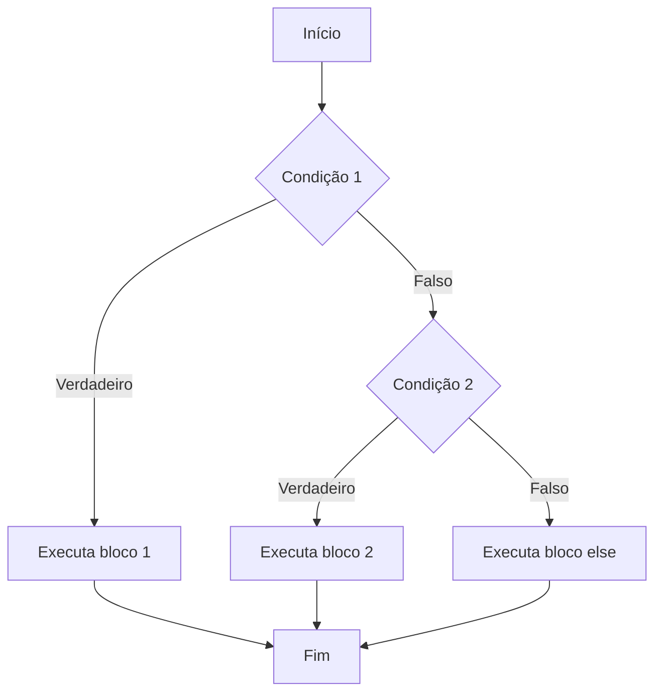
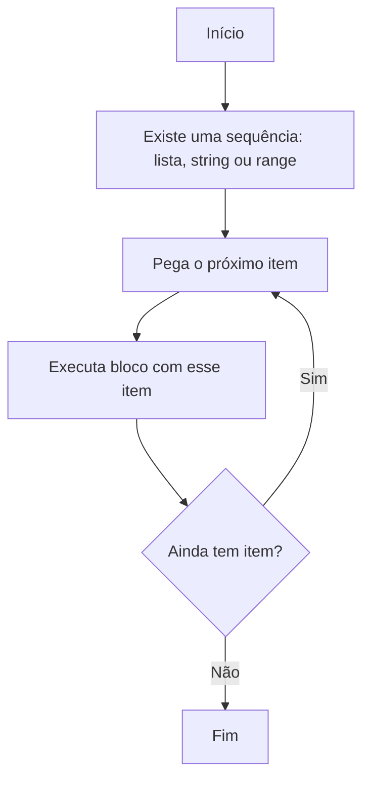
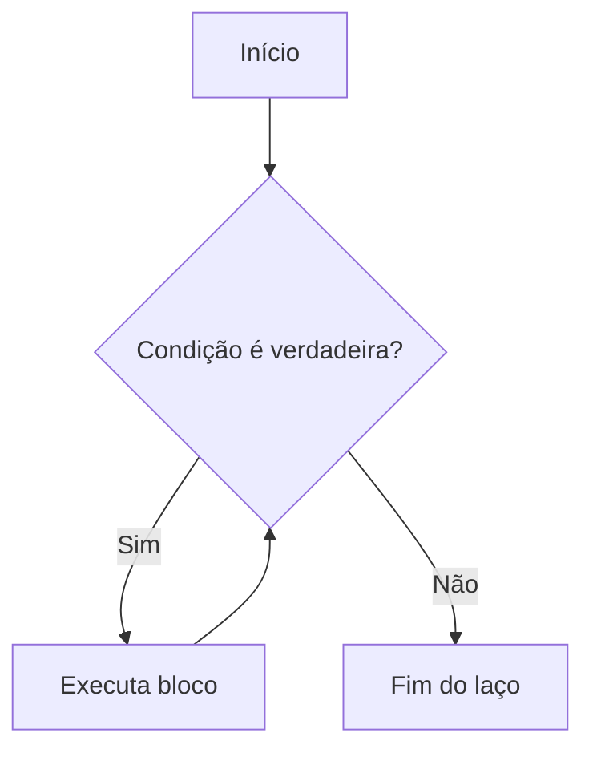
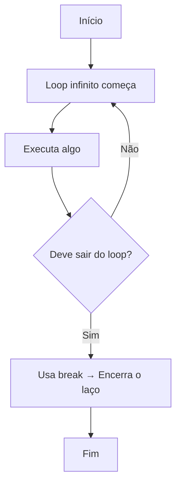

# 🐍 Estudos em Python - Gabriel Buchud

## 📘 Parte 3 – Condicionais e Laços de Repetição

> **Resumo:** Nesta parte vamos aprender a tomar decisões com `if`, `else` e `elif`, e a repetir ações com `for`, `while` e `while True`. Tudo com exemplos práticos, fluxogramas e comentários explicativos.

---

### 🧭 6. Estruturas Condicionais (`if`, `elif`, `else`)

Essas estruturas permitem que o programa **tome decisões** com base em condições.

Pense como um **semáforo**:

- Se o sinal estiver verde → você segue.  
- Se estiver amarelo → você desacelera.  
- Se estiver vermelho → você para.

```python
idade = 18

if idade >= 18:
    print("Pode entrar")  # Executa se a condição for verdadeira
else:
    print("Acesso negado")  # Executa se a condição for falsa
```

---

#### 🔀 E se tivermos mais de duas opções?

Use o `elif` (abreviação de “else if”).

```python
nota = 7

if nota >= 9:
    print("Excelente")     # Se nota for 9 ou mais
elif nota >= 6:
    print("Aprovado")      # Se nota for 6 até 8.9
else:
    print("Reprovado")     # Se nota for menor que 6
```

📌 O Python avalia **de cima para baixo**. A primeira condição verdadeira será executada e o resto será ignorado.

---

### ▶️ Fluxograma `if / elif / else`



---

### 🔁 7. Laços de Repetição

Servem para **executar uma ação várias vezes**, até que uma condição seja atingida.

---

#### 🔄 `for` – Ideal quando você sabe quantas vezes

```python
frutas = ["maçã", "banana", "uva"]

for fruta in frutas:
    print(fruta)  # Imprime cada item da lista
```

📦 O `for` percorre cada item da lista `frutas` e executa o bloco para cada um.

---

#### 📌 Usando `range()` com `for`

```python
for i in range(3):
    print(i)  # Imprime 0, 1, 2
```

📦 `range(n)` cria uma sequência de `0` até `n-1`.

---

### ▶️ Fluxograma `for item in sequência`



---

#### 🔁 `while` – Enquanto a condição for verdadeira

```python
contador = 0

while contador < 3:
    print(contador)    # Imprime contador enquanto < 3
    contador += 1      # Incrementa o valor
```

📦 O `while` verifica a condição antes de cada execução. Se for falsa, o laço para.

---

### ▶️ Fluxograma `while`



---

#### 🌀 `while True` – Laço infinito (até um `break`)

```python
while True:
    comando = input("Digite 'sair': ")
    if comando == "sair":
        break  # Encerra o laço se a condição for atendida
```

📦 Use com cuidado! O `break` precisa estar bem definido.

---

### ▶️ Fluxograma `while True` com break



---

### ✅ Dicas de boas práticas

- ✅ Nomeie variáveis de forma clara: `contador`, `item`, `mensagem`
- ✅ Sempre deixe o `while True` com uma condição de saída bem visível
- ✅ Use `range()` para loops controlados
- ✅ Use comentários dentro do código explicando o que está acontecendo
- ⚠️ Evite loops infinitos sem necessidade

```python
# Exemplo comentado
for i in range(5):
    print("Repetição número:", i)  # Executa 5 vezes (0 a 4)
```

---

### 🧠 Conclusão

Agora você já sabe como:

- Tomar decisões com `if`, `elif`, `else`
- Repetir ações com `for`, `while`, e `while True`
- Escrever código mais dinâmico e interativo

Na próxima parte, vamos mergulhar no mundo das **funções** e ver como dividir tarefas em blocos reutilizáveis.
